# snake-mania-unity2d

A Snake game made in Unity

## Play Game 
- <a href="https://carltonmpofu.itch.io/snake-mania" title="play game">Play Game</a>

## Screenshots
| Images | Images |
| --- | --- |
| 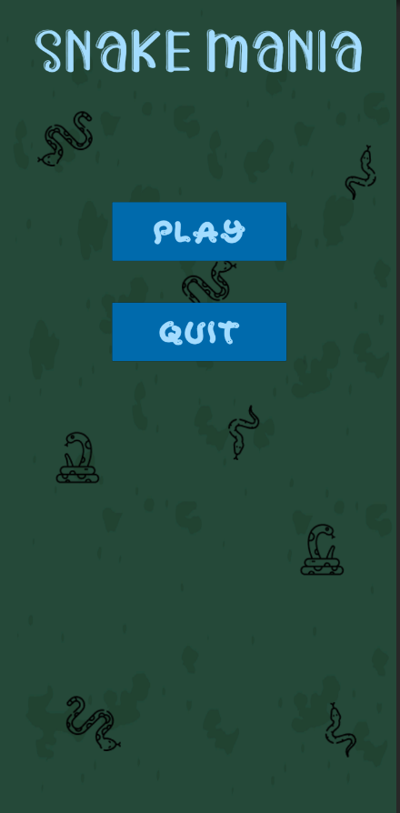 | 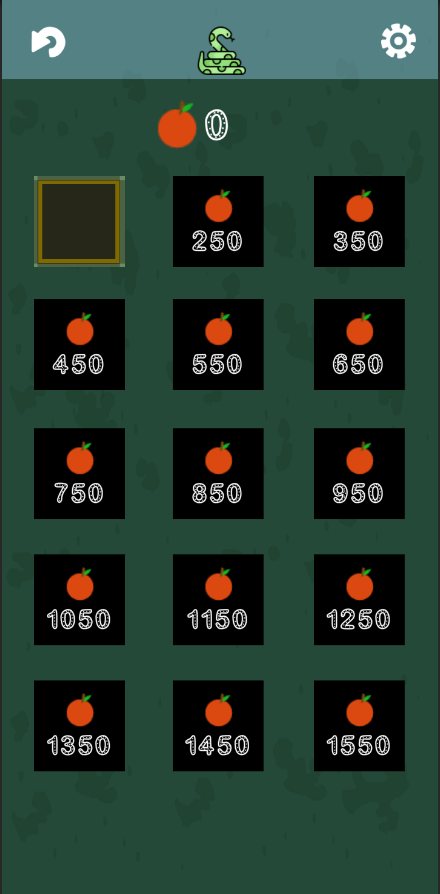 |
| 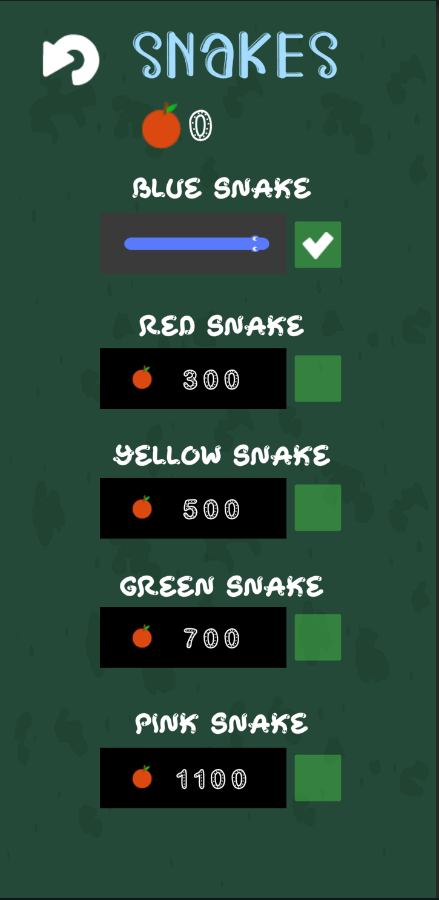 | 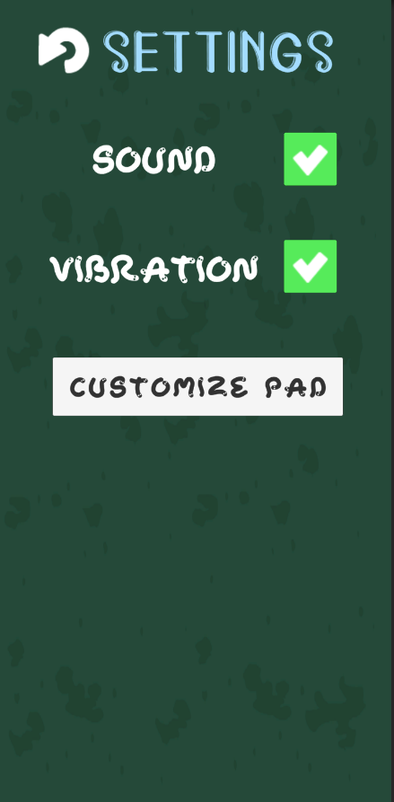|
| 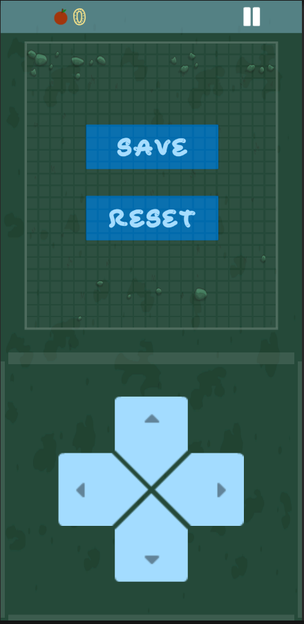| 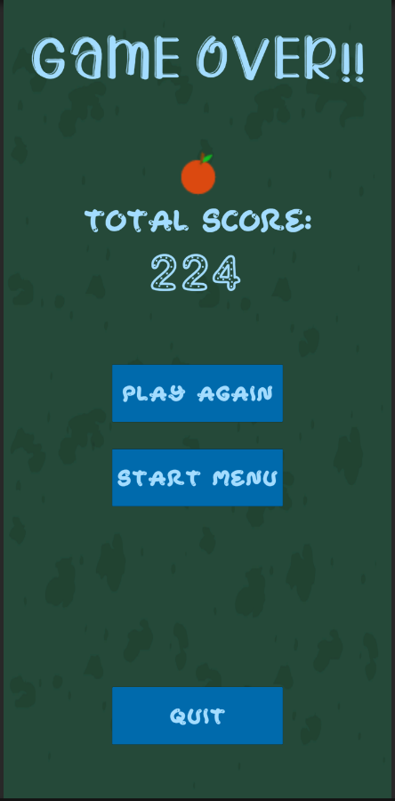 |
| 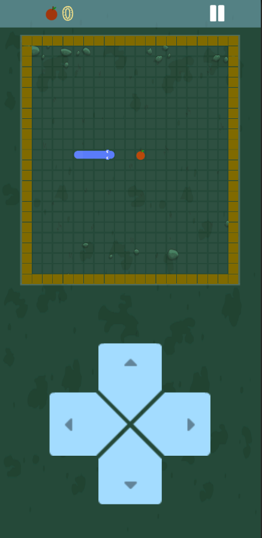| 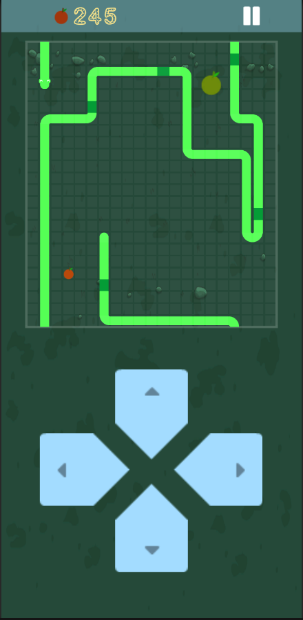 |
| 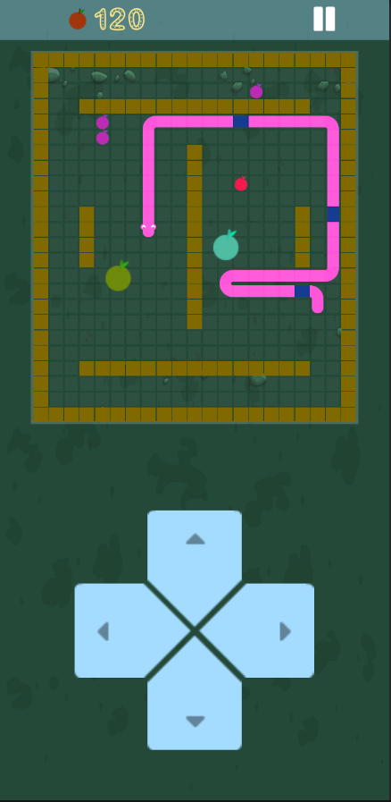 | 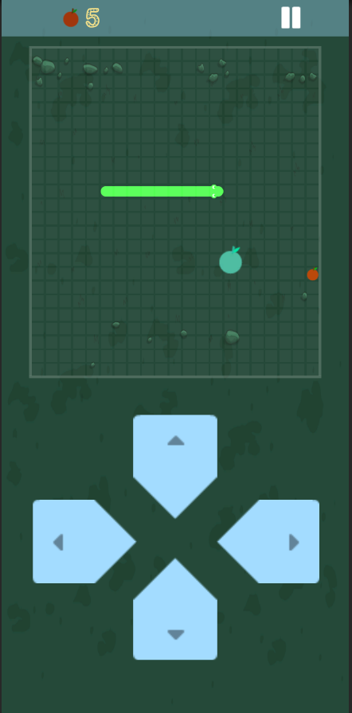 |
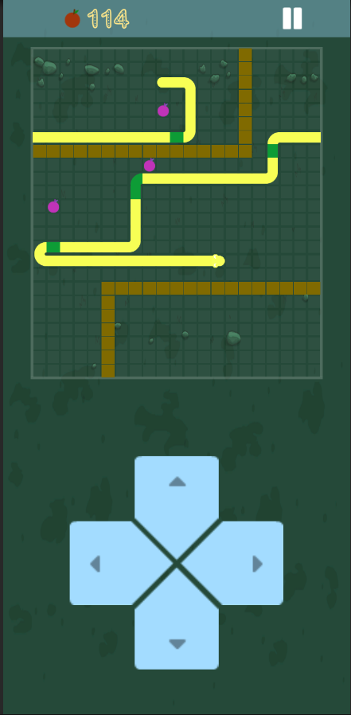

## Assets/Attribution

- Game icons, audio, and directional-pad buttons - [Kenny](https://www.kenney.nl/)
- Snake icons - 
	<a href="https://www.flaticon.com/free-icons/snake" title="snake icons">Snake icons created by Freepik - Flaticon</a>,
	<a href="https://www.flaticon.com/free-icons/anaconda" title="anaconda icons">Anaconda icons created by Good Ware - Flaticon</a>,
	<a href="https://www.flaticon.com/free-icon/snake_8582856" title="snake icons">Sanke icons created by Freepik - Flaticon</a>,
- Fonts - [dafont](https://www.dafont.com/)
- Snake body and food - [Clear_code](https://opengameart.org/content/snake-game-assets)
- Song (Ludum Dare 38 - Track 6) - [Abstraction](http://www.abstractionmusic.com/), or [Abstraction on itch.io](https://tallbeard.itch.io/music-loop-bundle)

	
	

